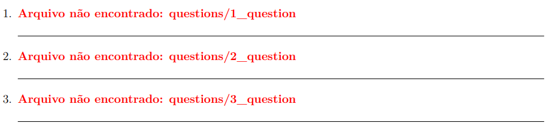
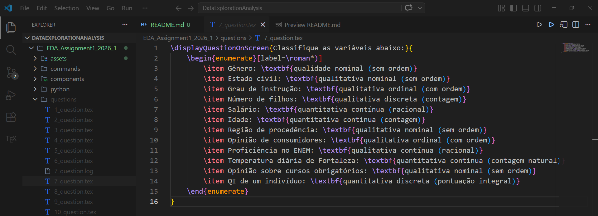

# EDA Assignment 1 (2026_1)

This directory contains a Python and LaTeX integration designed to generate predefined questions. The system uses LaTeX to define the structure and a Python script to control the number of questions generated, producing the corresponding files automatically.

The project emphasizes reproducibility between both tools, ensuring that the output remains consistent and can be regenerated reliably. This is part of an academic assignment, and I chose to develop this project as a way to connect and reinforce my learning in LaTeX through practical application combined with Python automation.

This project is an academic integration developed for an assignment in my Exploratory Data Analysis course, combined with my knowledge of LaTeX. The main goal is to simplify the workflow of manually creating a large single main file or generating each page individually. Instead, the project automates this process by generating structured LaTeX files, making the workflow more efficient, organized, and scalable.

## Requirements

- It is necessary to install **MiKTeX**, which is a local LaTeX distribution that allows you to compile LaTeX documents without relying on online tools such as Overleaf.  
  Installation: [MiKTeX](https://miktex.org/download)

- To gain access to the file generator (which produces documents ranging from question X to Y), you need to install **Python** on your machine. It is required to run the script that generates all LaTeX files with the predefined question structure.  
  Installation: [Python](https://www.python.org/downloads/)

- **TeXstudio** is an integrated LaTeX editor that provides specialized tools and features tailored for LaTeX development, which may not be available in other editors.  
  Installation: [TeXstudio](https://www.texstudio.org/)

- **VSCode** is an alternative code editor. While it is not as optimized for LaTeX as **TeXstudio**, it remains a viable option for editing and managing LaTeX projects.  
  Installation: [Visual Studio Code](https://code.visualstudio.com/)

| MiKTeX | Python | TexStudio | VSCode |
|------|------| ---------- | ---------------- |
|  |  |  |  |

## Layout 

```
git clone git@github.com:mateussmce/DataExplorationAnalysis.git or

git clone https://github.com/mateussmce/DataExplorationAnalysis.git
```

On first use, without running any command, the screen will display no questions. Additionally, a red warning message will appear indicating that no file named `x_question.tex` exists. At this point, it is necessary to use Python and follow the procedure below to generate all question files that are iteratively defined in the LaTeX structure.



After reaching this stage, it means your LaTeX code is working correctly. However, one important detail is that no questions are displayed.

This happens because the questions were not created manually inside the LaTeX file. Instead, each question is defined in a JSON file, which is later processed by Python to generate the corresponding number of LaTeX elements based on the JSON data.

But before we move on to the Python part, take a look at the following:

```
% EDA_Assignment1_2026_1/components/items_list.tex

\begin{enumerate}
	\foreach \i in {1,...,25} {
		\safeinput{questions/\i\_question}
		
		\rule{\textwidth}{0.4pt}
	}
\end{enumerate}
```

Above, we have a file called `items_list.tex`, where the expected number of questions is defined using a `foreach` loop (counter).

This means that if you want to increase or decrease the number of questions, you must manually update this value in this specific file.

If you only increase the size of the JSON file, the LaTeX counter will not automatically recognize the change, as there is no direct synchronization between the JSON structure and the LaTeX loop. This integration was not fully implemented due to limited development time.

Now we return to Python. At this stage, you should generate the questions using the Python script. It is assumed that Python is already installed on your system. Without it, the files from 1 to 25 will not be generated, which are required for the correct LaTeX structure. To execute the script and generate these 25 pages, follow the steps below:

```
Navigate to: `EDA_Assignment1_2026_1/python/src`

Then run the following command in your terminal (PowerShell or Git Bash):

py main.py

✅ Sucesso! 25 arquivos gerados 
```

After this step, a new folder named `questions` will be generated inside `EDA_Assignment1_2026_1`. Inside this folder, you should find 25 automatically generated files. These files follow the structure shown below:



After that, simply read each of the 25 generated files carefully. If you have basic knowledge of LaTeX, you will understand where to add your implementations, such as solving or filling in the questions. Once all files have been successfully generated, you can run the main LaTeX file of your project and compile it normally.

This is not a strict standard workflow, so you are free to fork this project and adapt it with your own implementations. I may not have explained everything in the most objective way, but by carefully reviewing each file, you should be able to understand the overall structure and workflow clearly.

## Contributors

- Programmer [@mateussmce](https://github.com/mateussmce)